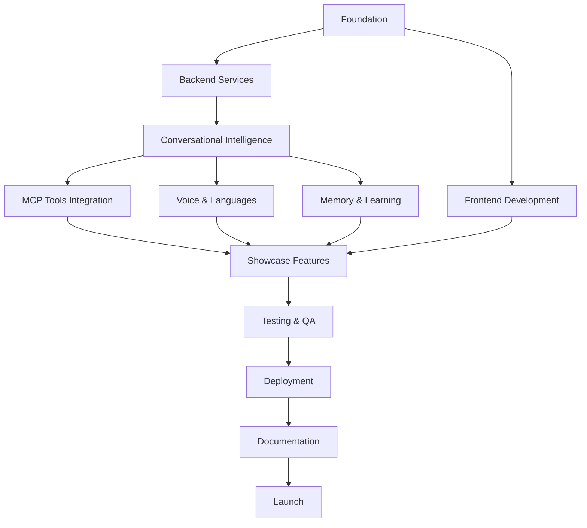

# ANKR_UNIVERSE_TODO - Master Task List

> **Project:** ANKR Universe - Unified Showcase Platform
> **Version:** 1.0.0
> **Last Updated:** 20 Jan 2026
> **Status:** Planning → Development

---

## Quick Stats

| Metric | Value |
|--------|-------|
| Total Tasks | 224 |
| Completed | 3 |
| In Progress | 0 |
| Pending | 221 |
| Blocked | 0 |

**Recent Completions:**
- [x] M-013: Integrate @ankr/devbrain API (port 4030)
- [x] M-014: Index 403→755 components
- [x] M-016: Add MCP tools to DevBrain catalog (341 tools)

---

## Table of Contents

1. [Phase 1: Foundation](#phase-1-foundation)
2. [Phase 2: Backend Services](#phase-2-backend-services)
3. [Phase 3: Conversational Intelligence](#phase-3-conversational-intelligence)
4. [Phase 4: Frontend Development](#phase-4-frontend-development)
5. [Phase 5: MCP Tools Integration](#phase-5-mcp-tools-integration)
6. [Phase 6: Voice & Languages](#phase-6-voice--languages)
7. [Phase 7: Memory & Learning](#phase-7-memory--learning)
8. [Phase 8: Showcase Features](#phase-8-showcase-features)
9. [Phase 9: Testing & QA](#phase-9-testing--qa)
10. [Phase 10: Deployment & DevOps](#phase-10-deployment--devops)
11. [Phase 11: Documentation](#phase-11-documentation)
12. [Phase 12: Launch & Marketing](#phase-12-launch--marketing)
13. [Phase 13: RocketLang DSL](#phase-13-rocketlang-dsl)

---

## Phase 1: Foundation

### 1.1 Project Setup

| ID | Task | Priority | Status | Owner | Tags |
|----|------|----------|--------|-------|------|
| F-001 | Initialize monorepo with Turborepo | P0 | [ ] | - | `Architecture` `DevOps` |
| F-002 | Configure TypeScript base config | P0 | [ ] | - | `Architecture` |
| F-003 | Set up ESLint + Prettier rules | P1 | [ ] | - | `DevOps` |
| F-004 | Configure Husky pre-commit hooks | P1 | [ ] | - | `DevOps` |
| F-005 | Set up environment variables structure | P0 | [ ] | - | `Architecture` `Security` |
| F-006 | Create shared packages structure | P0 | [ ] | - | `Architecture` |
| F-007 | Set up Verdaccio for local packages | P1 | [ ] | - | `DevOps` |

### 1.2 Database Setup

| ID | Task | Priority | Status | Owner | Tags |
|----|------|----------|--------|-------|------|
| F-008 | Design complete Prisma schema | P0 | [ ] | - | `Database` `Architecture` |
| F-009 | Set up PostgreSQL with pgvector | P0 | [ ] | - | `Database` `AI/ML` |
| F-010 | Create database migrations | P0 | [ ] | - | `Database` |
| F-011 | Set up Redis for caching/sessions | P0 | [ ] | - | `Database` `Backend` |
| F-012 | Create seed data scripts | P1 | [ ] | - | `Database` `Testing` |
| F-013 | Set up database backup strategy | P2 | [ ] | - | `Database` `DevOps` |
| F-014 | Configure connection pooling | P1 | [ ] | - | `Database` `Backend` |

### 1.3 Docker Infrastructure

| ID | Task | Priority | Status | Owner | Tags |
|----|------|----------|--------|-------|------|
| F-015 | Create docker-compose.yml | P0 | [ ] | - | `DevOps` `Deployment` |
| F-016 | Dockerize gateway service | P0 | [ ] | - | `Backend` `DevOps` |
| F-017 | Dockerize web frontend | P0 | [ ] | - | `Frontend` `DevOps` |
| F-018 | Set up Ollama container for SLM | P0 | [ ] | - | `AI/ML` `DevOps` |
| F-019 | Configure Docker networking | P1 | [ ] | - | `DevOps` |
| F-020 | Create production Docker configs | P1 | [ ] | - | `DevOps` `Deployment` |

---

## Phase 2: Backend Services

### 2.1 Gateway API

| ID | Task | Priority | Status | Owner | Tags |
|----|------|----------|--------|-------|------|
| B-001 | Set up Fastify server structure | P0 | [ ] | - | `Backend` `API` |
| B-002 | Integrate Mercurius for GraphQL | P0 | [ ] | - | `Backend` `API` |
| B-003 | Create GraphQL schema (SDL) | P0 | [ ] | - | `Backend` `API` `Architecture` |
| B-004 | Implement authentication plugin | P0 | [ ] | - | `Backend` `Authentication` `Security` |
| B-005 | Implement rate limiting | P1 | [ ] | - | `Backend` `Security` |
| B-006 | Set up request ID tracing | P1 | [ ] | - | `Backend` `DevOps` |
| B-007 | Create error handling middleware | P0 | [ ] | - | `Backend` `API` |
| B-008 | Implement CORS configuration | P0 | [ ] | - | `Backend` `Security` |
| B-009 | Set up Helmet security headers | P1 | [ ] | - | `Backend` `Security` |

### 2.2 GraphQL Resolvers

| ID | Task | Priority | Status | Owner | Tags |
|----|------|----------|--------|-------|------|
| B-010 | Create conversation resolvers | P0 | [ ] | - | `Backend` `API` |
| B-011 | Create message resolvers | P0 | [ ] | - | `Backend` `API` |
| B-012 | Create tool execution resolvers | P0 | [ ] | - | `Backend` `API` |
| B-013 | Create memory resolvers | P0 | [ ] | - | `Backend` `API` `AI/ML` |
| B-014 | Create showcase resolvers (tools, packages, demos) | P0 | [ ] | - | `Backend` `API` |
| B-015 | Create metrics resolvers | P1 | [ ] | - | `Backend` `API` |
| B-016 | Create user/auth resolvers | P0 | [ ] | - | `Backend` `API` `Authentication` |
| B-017 | Implement subscription resolvers | P0 | [ ] | - | `Backend` `API` `Realtime` |

### 2.3 WebSocket Server

| ID | Task | Priority | Status | Owner | Tags |
|----|------|----------|--------|-------|------|
| B-018 | Set up WebSocket server with Fastify | P0 | [ ] | - | `Backend` `Realtime` |
| B-019 | Implement conversation handler | P0 | [ ] | - | `Backend` `Realtime` |
| B-020 | Implement voice handler | P0 | [ ] | - | `Backend` `Realtime` `AI/ML` |
| B-021 | Implement pulse (metrics) handler | P1 | [ ] | - | `Backend` `Realtime` |
| B-022 | Create WebSocket authentication | P0 | [ ] | - | `Backend` `Authentication` `Security` |
| B-023 | Implement heartbeat/ping-pong | P1 | [ ] | - | `Backend` `Realtime` |
| B-024 | Handle reconnection logic | P1 | [ ] | - | `Backend` `Realtime` |

### 2.4 Services Layer

| ID | Task | Priority | Status | Owner | Tags |
|----|------|----------|--------|-------|------|
| B-025 | Create ConversationService | P0 | [ ] | - | `Backend` |
| B-026 | Create OrchestratorService | P0 | [ ] | - | `Backend` `AI/ML` |
| B-027 | Create ToolExecutorService | P0 | [ ] | - | `Backend` |
| B-028 | Create ShowcaseService | P1 | [ ] | - | `Backend` |
| B-029 | Create MetricsService | P1 | [ ] | - | `Backend` |
| B-030 | Create UserService | P0 | [ ] | - | `Backend` `Authentication` |
| B-031 | Implement Circuit Breaker pattern | P1 | [ ] | - | `Backend` `Architecture` |
| B-032 | Implement Retry with backoff | P1 | [ ] | - | `Backend` `Architecture` |

---

## Phase 3: Conversational Intelligence

### 3.1 Intent Classification

| ID | Task | Priority | Status | Owner | Tags |
|----|------|----------|--------|-------|------|
| C-001 | Port IntentClassifier from Swayam | P0 | [ ] | - | `AI/ML` |
| C-002 | Add 70+ intent patterns | P0 | [ ] | - | `AI/ML` |
| C-003 | Implement keyword fallback | P0 | [ ] | - | `AI/ML` |
| C-004 | Integrate AI classification (Groq) | P0 | [ ] | - | `AI/ML` |
| C-005 | Add Hindi/English code-switching | P0 | [ ] | - | `AI/ML` `Logistics` |
| C-006 | Create domain-specific classifiers | P1 | [ ] | - | `AI/ML` |
| C-007 | Implement confidence scoring | P0 | [ ] | - | `AI/ML` |

### 3.2 Entity Extraction

| ID | Task | Priority | Status | Owner | Tags |
|----|------|----------|--------|-------|------|
| C-008 | Port EntityExtractor from Swayam | P0 | [ ] | - | `AI/ML` |
| C-009 | Add Indian ID patterns (GSTIN, PAN, Aadhaar) | P0 | [ ] | - | `AI/ML` `Compliance` |
| C-010 | Add financial entity extraction | P0 | [ ] | - | `AI/ML` `Billing` |
| C-011 | Add vehicle registration patterns | P0 | [ ] | - | `AI/ML` `Logistics` |
| C-012 | Add date/time extraction (multiple formats) | P0 | [ ] | - | `AI/ML` |
| C-013 | Add location extraction (pincodes, cities) | P0 | [ ] | - | `AI/ML` `Logistics` |
| C-014 | Implement entity normalization | P1 | [ ] | - | `AI/ML` |
| C-015 | Add entity validation | P1 | [ ] | - | `AI/ML` |

### 3.3 Context Engine

| ID | Task | Priority | Status | Owner | Tags |
|----|------|----------|--------|-------|------|
| C-016 | Port ContextEngine three-layer architecture | P0 | [ ] | - | `AI/ML` `Architecture` |
| C-017 | Implement Identity Layer | P0 | [ ] | - | `AI/ML` |
| C-018 | Implement Knowledge Layer (RAG) | P0 | [ ] | - | `AI/ML` |
| C-019 | Implement Transient Layer | P0 | [ ] | - | `AI/ML` |
| C-020 | Add token budget management | P0 | [ ] | - | `AI/ML` |
| C-021 | Implement context compression | P1 | [ ] | - | `AI/ML` |
| C-022 | Add context caching (LRU) | P1 | [ ] | - | `AI/ML` `Backend` |
| C-023 | Implement context snapshots | P2 | [ ] | - | `AI/ML` |

### 3.4 SLM Router

| ID | Task | Priority | Status | Owner | Tags |
|----|------|----------|--------|-------|------|
| C-024 | Integrate @ankr/slm-router package | P0 | [ ] | - | `AI/ML` |
| C-025 | Configure Tier 0: EON Memory | P0 | [ ] | - | `AI/ML` |
| C-026 | Configure Tier 1: Deterministic | P0 | [ ] | - | `AI/ML` |
| C-027 | Configure Tier 2: SLM (Ollama) | P0 | [ ] | - | `AI/ML` |
| C-028 | Configure Tier 3: LLM fallback | P0 | [ ] | - | `AI/ML` |
| C-029 | Implement routing decision logging | P1 | [ ] | - | `AI/ML` `DevOps` |
| C-030 | Add routing visualization data | P1 | [ ] | - | `AI/ML` `Frontend` |

### 3.5 Response Generation

| ID | Task | Priority | Status | Owner | Tags |
|----|------|----------|--------|-------|------|
| C-031 | Create ResponseGenerator service | P0 | [ ] | - | `AI/ML` |
| C-032 | Implement persona-specific formatting | P0 | [ ] | - | `AI/ML` |
| C-033 | Add language-specific responses | P0 | [ ] | - | `AI/ML` |
| C-034 | Generate follow-up suggestions | P1 | [ ] | - | `AI/ML` |
| C-035 | Implement streaming responses | P1 | [ ] | - | `AI/ML` `Backend` |

---

## Phase 4: Frontend Development

### 4.1 Project Setup

| ID | Task | Priority | Status | Owner | Tags |
|----|------|----------|--------|-------|------|
| FE-001 | Initialize React 19 + Vite project | P0 | [ ] | - | `Frontend` |
| FE-002 | Set up TailwindCSS 4 | P0 | [ ] | - | `Frontend` |
| FE-003 | Install and configure Shadcn/UI | P0 | [ ] | - | `Frontend` |
| FE-004 | Set up React Router 7 | P0 | [ ] | - | `Frontend` |
| FE-005 | Configure Apollo Client | P0 | [ ] | - | `Frontend` `API` |
| FE-006 | Set up Zustand stores | P0 | [ ] | - | `Frontend` |
| FE-007 | Configure WebSocket client | P0 | [ ] | - | `Frontend` `Realtime` |

### 4.2 Shared Components

| ID | Task | Priority | Status | Owner | Tags |
|----|------|----------|--------|-------|------|
| FE-008 | Create Layout component | P0 | [ ] | - | `Frontend` |
| FE-009 | Create Navigation component | P0 | [ ] | - | `Frontend` |
| FE-010 | Create ThemeProvider (dark mode) | P1 | [ ] | - | `Frontend` |
| FE-011 | Create LoadingStates components | P1 | [ ] | - | `Frontend` |
| FE-012 | Create ErrorBoundary component | P0 | [ ] | - | `Frontend` |
| FE-013 | Create Toast/Notification system | P1 | [ ] | - | `Frontend` |
| FE-014 | Create Badge component variants | P1 | [ ] | - | `Frontend` |
| FE-015 | Create Card component variants | P1 | [ ] | - | `Frontend` |

### 4.3 Conversation Components

| ID | Task | Priority | Status | Owner | Tags |
|----|------|----------|--------|-------|------|
| FE-016 | Create ChatInterface component | P0 | [ ] | - | `Frontend` `AI/ML` |
| FE-017 | Create MessageBubble component | P0 | [ ] | - | `Frontend` |
| FE-018 | Create VoiceInput component | P0 | [ ] | - | `Frontend` `AI/ML` |
| FE-019 | Create TextInput component | P0 | [ ] | - | `Frontend` |
| FE-020 | Create ToolExecution component | P0 | [ ] | - | `Frontend` |
| FE-021 | Create MemoryPanel component | P0 | [ ] | - | `Frontend` `AI/ML` |
| FE-022 | Create RoutingIndicator component | P1 | [ ] | - | `Frontend` `AI/ML` |
| FE-023 | Create PersonaSelector component | P1 | [ ] | - | `Frontend` |
| FE-024 | Create LanguageSelector component | P0 | [ ] | - | `Frontend` |
| FE-025 | Create QuickActions component | P1 | [ ] | - | `Frontend` |
| FE-026 | Create TypingIndicator component | P1 | [ ] | - | `Frontend` |
| FE-027 | Create Waveform visualization | P1 | [ ] | - | `Frontend` `AI/ML` |

### 4.4 Showcase Components

| ID | Task | Priority | Status | Owner | Tags |
|----|------|----------|--------|-------|------|
| FE-028 | Create ToolExplorer page | P0 | [ ] | - | `Frontend` |
| FE-029 | Create ToolCard component | P0 | [ ] | - | `Frontend` |
| FE-030 | Create ToolPlayground component | P0 | [ ] | - | `Frontend` |
| FE-031 | Create ToolDocs component | P1 | [ ] | - | `Frontend` `Documentation` |
| FE-032 | Create PackageCatalog page | P0 | [ ] | - | `Frontend` |
| FE-033 | Create PackageCard component | P0 | [ ] | - | `Frontend` |
| FE-034 | Create PackageDetails component | P1 | [ ] | - | `Frontend` |
| FE-035 | Create DemoGallery page | P0 | [ ] | - | `Frontend` |
| FE-036 | Create DemoCard component | P1 | [ ] | - | `Frontend` |
| FE-037 | Create DemoRunner component | P0 | [ ] | - | `Frontend` |
| FE-038 | Create ProductShowcase page | P1 | [ ] | - | `Frontend` |
| FE-039 | Create ProductCard component | P1 | [ ] | - | `Frontend` |

### 4.5 Pulse Dashboard

| ID | Task | Priority | Status | Owner | Tags |
|----|------|----------|--------|-------|------|
| FE-040 | Create Pulse dashboard page | P1 | [ ] | - | `Frontend` |
| FE-041 | Create SystemStatus component | P1 | [ ] | - | `Frontend` |
| FE-042 | Create MetricsDisplay component | P1 | [ ] | - | `Frontend` |
| FE-043 | Create ActivityStream component | P1 | [ ] | - | `Frontend` `Realtime` |
| FE-044 | Create CostTracker component | P1 | [ ] | - | `Frontend` `Billing` |
| FE-045 | Create ServiceHealth component | P1 | [ ] | - | `Frontend` `DevOps` |
| FE-046 | Integrate Recharts for metrics | P1 | [ ] | - | `Frontend` |

### 4.6 Landing Page

| ID | Task | Priority | Status | Owner | Tags |
|----|------|----------|--------|-------|------|
| FE-047 | Create HeroSection component | P0 | [ ] | - | `Frontend` |
| FE-048 | Create MetricsTicker component | P0 | [ ] | - | `Frontend` `Realtime` |
| FE-049 | Create QuickDemo component | P0 | [ ] | - | `Frontend` |
| FE-050 | Create QuickAccessCards component | P0 | [ ] | - | `Frontend` |
| FE-051 | Create FeatureHighlights section | P1 | [ ] | - | `Frontend` |
| FE-052 | Add particle animations (optional) | P2 | [ ] | - | `Frontend` |

### 4.7 Memory Visualization

| ID | Task | Priority | Status | Owner | Tags |
|----|------|----------|--------|-------|------|
| FE-053 | Set up Three.js / React Three Fiber | P1 | [ ] | - | `Frontend` `AI/ML` |
| FE-054 | Create 3D MemoryGraph component | P1 | [ ] | - | `Frontend` `AI/ML` |
| FE-055 | Implement force-directed layout | P1 | [ ] | - | `Frontend` |
| FE-056 | Add memory type coloring | P1 | [ ] | - | `Frontend` |
| FE-057 | Create MemoryStream component | P1 | [ ] | - | `Frontend` `Realtime` |
| FE-058 | Create MemoryStats component | P1 | [ ] | - | `Frontend` |

---

## Phase 5: MCP Tools Integration

### 5.1 Tool Registry

| ID | Task | Priority | Status | Owner | Tags |
|----|------|----------|--------|-------|------|
| T-001 | Create tool registry from @powerpbox/mcp | P0 | [ ] | - | `Backend` `API` |
| T-002 | Index all 350+ tools in database | P0 | [ ] | - | `Database` |
| T-003 | Categorize tools by domain | P0 | [ ] | - | `Backend` |
| T-004 | Generate tool documentation | P1 | [ ] | - | `Documentation` |
| T-005 | Create tool search functionality | P0 | [ ] | - | `Backend` `API` |

### 5.2 Tool Execution

| ID | Task | Priority | Status | Owner | Tags |
|----|------|----------|--------|-------|------|
| T-006 | Create ToolExecutor service | P0 | [ ] | - | `Backend` |
| T-007 | Implement parameter validation | P0 | [ ] | - | `Backend` |
| T-008 | Add execution tracking | P0 | [ ] | - | `Backend` |
| T-009 | Implement execution timeout | P1 | [ ] | - | `Backend` |
| T-010 | Add execution cost tracking | P1 | [ ] | - | `Backend` `Billing` |
| T-011 | Create tool result formatting | P1 | [ ] | - | `Backend` |

### 5.3 Tool Categories

| ID | Task | Priority | Status | Owner | Tags |
|----|------|----------|--------|-------|------|
| T-012 | Integrate GST tools (54) | P0 | [ ] | - | `Compliance` |
| T-013 | Integrate Banking tools (28) | P0 | [ ] | - | `Billing` `Customers` |
| T-014 | Integrate Logistics tools (35) | P0 | [ ] | - | `Logistics` |
| T-015 | Integrate ERP tools (44) | P0 | [ ] | - | `Backend` |
| T-016 | Integrate CRM tools (30) | P1 | [ ] | - | `Customers` |
| T-017 | Integrate Government tools (22) | P0 | [ ] | - | `Compliance` |
| T-018 | Integrate Voice tools (14) | P0 | [ ] | - | `AI/ML` |
| T-019 | Integrate Memory tools (14) | P0 | [ ] | - | `AI/ML` |

---

## Phase 6: Voice & Languages

### 6.1 Speech-to-Text

| ID | Task | Priority | Status | Owner | Tags |
|----|------|----------|--------|-------|------|
| V-001 | Integrate Web Speech API | P0 | [ ] | - | `Frontend` `AI/ML` |
| V-002 | Add Sarvam STT for Hindi | P0 | [ ] | - | `AI/ML` |
| V-003 | Implement streaming transcription | P1 | [ ] | - | `AI/ML` `Realtime` |
| V-004 | Add language detection | P1 | [ ] | - | `AI/ML` |
| V-005 | Handle code-switching | P1 | [ ] | - | `AI/ML` |

### 6.2 Text-to-Speech

| ID | Task | Priority | Status | Owner | Tags |
|----|------|----------|--------|-------|------|
| V-006 | Integrate Sarvam TTS for Indian languages | P0 | [ ] | - | `AI/ML` |
| V-007 | Add voice selection per language | P1 | [ ] | - | `AI/ML` |
| V-008 | Implement audio streaming | P1 | [ ] | - | `AI/ML` `Realtime` |
| V-009 | Add voice speed control | P2 | [ ] | - | `Frontend` |

### 6.3 Language Support

| ID | Task | Priority | Status | Owner | Tags |
|----|------|----------|--------|-------|------|
| V-010 | Support Hindi (hi) | P0 | [ ] | - | `AI/ML` |
| V-011 | Support English (en) | P0 | [ ] | - | `AI/ML` |
| V-012 | Support Tamil (ta) | P1 | [ ] | - | `AI/ML` |
| V-013 | Support Telugu (te) | P1 | [ ] | - | `AI/ML` |
| V-014 | Support Bengali (bn) | P1 | [ ] | - | `AI/ML` |
| V-015 | Support Marathi (mr) | P1 | [ ] | - | `AI/ML` |
| V-016 | Support Gujarati (gu) | P2 | [ ] | - | `AI/ML` |
| V-017 | Support Kannada (kn) | P2 | [ ] | - | `AI/ML` |
| V-018 | Support Malayalam (ml) | P2 | [ ] | - | `AI/ML` |
| V-019 | Support Punjabi (pa) | P2 | [ ] | - | `AI/ML` |
| V-020 | Support Odia (or) | P2 | [ ] | - | `AI/ML` |

---

## Phase 7: Memory & Learning

### 7.1 EON Integration

| ID | Task | Priority | Status | Owner | Tags |
|----|------|----------|--------|-------|------|
| M-001 | Integrate @ankr/eon package | P0 | [ ] | - | `AI/ML` |
| M-002 | Configure episodic memory | P0 | [ ] | - | `AI/ML` |
| M-003 | Configure semantic memory | P0 | [ ] | - | `AI/ML` |
| M-004 | Configure procedural memory | P0 | [ ] | - | `AI/ML` |
| M-005 | Implement memory storage | P0 | [ ] | - | `AI/ML` `Database` |
| M-006 | Implement memory retrieval | P0 | [ ] | - | `AI/ML` |
| M-007 | Add semantic search (pgvector) | P0 | [ ] | - | `AI/ML` `Database` |

### 7.2 Learning System

| ID | Task | Priority | Status | Owner | Tags |
|----|------|----------|--------|-------|------|
| M-008 | Track user preferences | P1 | [ ] | - | `AI/ML` `Customers` |
| M-009 | Learn from tool usage patterns | P1 | [ ] | - | `AI/ML` |
| M-010 | Implement smart forgetting | P2 | [ ] | - | `AI/ML` |
| M-011 | Add memory importance scoring | P2 | [ ] | - | `AI/ML` |
| M-012 | Create memory visualization data | P1 | [ ] | - | `AI/ML` `Frontend` |

### 7.3 DevBrain Integration (Code Intelligence)

| ID | Task | Priority | Status | Owner | Tags |
|----|------|----------|--------|-------|------|
| M-013 | Integrate @ankr/devbrain API (port 4030) | P0 | [x] | - | `AI/ML` `DevBrain` |
| M-014 | Index 403 components (301 packages, 40 libs, 62 apps) | P0 | [x] | - | `AI/ML` `DevBrain` |
| M-015 | Generate Nomic embeddings for semantic search | P1 | [ ] | - | `AI/ML` `DevBrain` |
| M-016 | Add MCP tools to DevBrain catalog | P1 | [x] | - | `AI/ML` `DevBrain` `MCP` |
| M-017 | Create DevBrain search UI component | P1 | [ ] | - | `Frontend` `DevBrain` |
| M-018 | Integrate DevBrain with VibeCoder | P1 | [ ] | - | `AI/ML` `DevBrain` |
| M-019 | Add code generation via DevBrain.execute() | P1 | [ ] | - | `AI/ML` `DevBrain` |
| M-020 | Implement multi-LLM competition (GPT/Claude/DeepSeek) | P2 | [ ] | - | `AI/ML` `DevBrain` |
| M-021 | Add AI Judge for code quality scoring | P2 | [ ] | - | `AI/ML` `DevBrain` |

**DevBrain Stats (Updated 20 Jan 2026):**
- Total Components: 755
- Packages: 301 (Verdaccio: 227 + Source: 74)
- Libraries: 40
- Apps: 62
- MCP Tools: 341 (GST, HSN, SAC, TMS, Ports, EON, Logistics, Banking, ERP, CRM)
- Skills: 11 (india/gst, india/upi, india/ulip, logistics/tracking, messaging/telegram, etc.)
- Layers: 15 (ai, domain, infra, ui, voice, memory, docs, gps, messaging, devbrain, etc.)
- Port: 4030
- Embeddings: Nomic nomic-embed-text-v1.5 (128 have embeddings)

---

## Phase 8: Showcase Features

### 8.1 Tool Playgrounds

| ID | Task | Priority | Status | Owner | Tags |
|----|------|----------|--------|-------|------|
| S-001 | Create GST Calculator playground | P0 | [ ] | - | `Frontend` `Compliance` |
| S-002 | Create E-Invoice playground | P0 | [ ] | - | `Frontend` `Compliance` |
| S-003 | Create E-Way Bill playground | P0 | [ ] | - | `Frontend` `Logistics` |
| S-004 | Create WhatsApp playground | P1 | [ ] | - | `Frontend` |
| S-005 | Create Vehicle Track playground | P1 | [ ] | - | `Frontend` `Logistics` |
| S-006 | Create Credit Decision playground | P1 | [ ] | - | `Frontend` `Insurance` |

### 8.2 Demo Flows

| ID | Task | Priority | Status | Owner | Tags |
|----|------|----------|--------|-------|------|
| S-007 | Create Voice→Invoice→WhatsApp demo | P0 | [ ] | - | `Frontend` `AI/ML` |
| S-008 | Create Track→Route→ETA demo | P0 | [ ] | - | `Frontend` `Logistics` |
| S-009 | Create Credit Decision demo | P1 | [ ] | - | `Frontend` `Insurance` |
| S-010 | Create Multi-language demo | P1 | [ ] | - | `Frontend` `AI/ML` |
| S-011 | Create Memory Learning demo | P1 | [ ] | - | `Frontend` `AI/ML` |

### 8.3 Product Embeds

| ID | Task | Priority | Status | Owner | Tags |
|----|------|----------|--------|-------|------|
| S-012 | Embed WowTruck preview | P1 | [ ] | - | `Frontend` `Logistics` |
| S-013 | Embed ankrBFC preview | P1 | [ ] | - | `Frontend` `Customers` |
| S-014 | Embed Swayam voice demo | P0 | [ ] | - | `Frontend` `AI/ML` |
| S-015 | Create product case studies | P2 | [ ] | - | `Documentation` |

---

## Phase 9: Testing & QA

### 9.1 Unit Testing

| ID | Task | Priority | Status | Owner | Tags |
|----|------|----------|--------|-------|------|
| Q-001 | Set up Vitest for frontend | P0 | [ ] | - | `Testing` `Frontend` |
| Q-002 | Set up Jest for backend | P0 | [ ] | - | `Testing` `Backend` |
| Q-003 | Test IntentClassifier | P0 | [ ] | - | `Testing` `AI/ML` |
| Q-004 | Test EntityExtractor | P0 | [ ] | - | `Testing` `AI/ML` |
| Q-005 | Test ContextEngine | P0 | [ ] | - | `Testing` `AI/ML` |
| Q-006 | Test SLM Router | P0 | [ ] | - | `Testing` `AI/ML` |
| Q-007 | Test GraphQL resolvers | P0 | [ ] | - | `Testing` `API` |

### 9.2 Integration Testing

| ID | Task | Priority | Status | Owner | Tags |
|----|------|----------|--------|-------|------|
| Q-008 | Test conversation flow end-to-end | P0 | [ ] | - | `Testing` |
| Q-009 | Test tool execution pipeline | P0 | [ ] | - | `Testing` |
| Q-010 | Test WebSocket communication | P0 | [ ] | - | `Testing` `Realtime` |
| Q-011 | Test voice pipeline | P1 | [ ] | - | `Testing` `AI/ML` |
| Q-012 | Test memory operations | P1 | [ ] | - | `Testing` `AI/ML` |

### 9.3 E2E Testing

| ID | Task | Priority | Status | Owner | Tags |
|----|------|----------|--------|-------|------|
| Q-013 | Set up Playwright | P1 | [ ] | - | `Testing` `Frontend` |
| Q-014 | Test landing page flow | P1 | [ ] | - | `Testing` |
| Q-015 | Test chat interface | P1 | [ ] | - | `Testing` |
| Q-016 | Test tool explorer | P1 | [ ] | - | `Testing` |
| Q-017 | Test demo flows | P1 | [ ] | - | `Testing` |

### 9.4 Performance Testing

| ID | Task | Priority | Status | Owner | Tags |
|----|------|----------|--------|-------|------|
| Q-018 | Benchmark SLM routing latency | P1 | [ ] | - | `Testing` `AI/ML` |
| Q-019 | Load test WebSocket connections | P1 | [ ] | - | `Testing` `Realtime` |
| Q-020 | Test concurrent tool executions | P1 | [ ] | - | `Testing` `Backend` |
| Q-021 | Profile frontend bundle size | P2 | [ ] | - | `Testing` `Frontend` |

---

## Phase 10: Deployment & DevOps

### 10.1 CI/CD Pipeline

| ID | Task | Priority | Status | Owner | Tags |
|----|------|----------|--------|-------|------|
| D-001 | Set up GitHub Actions | P0 | [ ] | - | `DevOps` `Deployment` |
| D-002 | Create build workflow | P0 | [ ] | - | `DevOps` |
| D-003 | Create test workflow | P0 | [ ] | - | `DevOps` `Testing` |
| D-004 | Create deploy workflow | P0 | [ ] | - | `DevOps` `Deployment` |
| D-005 | Set up staging environment | P1 | [ ] | - | `DevOps` `Deployment` |
| D-006 | Set up production environment | P0 | [ ] | - | `DevOps` `Deployment` |

### 10.2 Infrastructure

| ID | Task | Priority | Status | Owner | Tags |
|----|------|----------|--------|-------|------|
| D-007 | Configure Cloudflare CDN | P1 | [ ] | - | `DevOps` |
| D-008 | Set up SSL certificates | P0 | [ ] | - | `DevOps` `Security` |
| D-009 | Configure DNS | P0 | [ ] | - | `DevOps` |
| D-010 | Set up log aggregation | P1 | [ ] | - | `DevOps` |
| D-011 | Configure alerting | P1 | [ ] | - | `DevOps` |

### 10.3 Monitoring

| ID | Task | Priority | Status | Owner | Tags |
|----|------|----------|--------|-------|------|
| D-012 | Set up Prometheus metrics | P1 | [ ] | - | `DevOps` |
| D-013 | Configure Grafana dashboards | P1 | [ ] | - | `DevOps` |
| D-014 | Set up OpenTelemetry tracing | P2 | [ ] | - | `DevOps` |
| D-015 | Configure uptime monitoring | P1 | [ ] | - | `DevOps` |

---

## Phase 11: Documentation

### 11.1 Technical Docs

| ID | Task | Priority | Status | Owner | Tags |
|----|------|----------|--------|-------|------|
| DOC-001 | Write API documentation | P0 | [ ] | - | `Documentation` `API` |
| DOC-002 | Write WebSocket protocol docs | P0 | [ ] | - | `Documentation` `Realtime` |
| DOC-003 | Document database schema | P1 | [ ] | - | `Documentation` `Database` |
| DOC-004 | Create architecture diagrams | P0 | [ ] | - | `Documentation` `Architecture` |
| DOC-005 | Document deployment process | P1 | [ ] | - | `Documentation` `Deployment` |

### 11.2 User Docs

| ID | Task | Priority | Status | Owner | Tags |
|----|------|----------|--------|-------|------|
| DOC-006 | Write getting started guide | P0 | [ ] | - | `Documentation` |
| DOC-007 | Create tool usage examples | P0 | [ ] | - | `Documentation` |
| DOC-008 | Write voice command guide | P1 | [ ] | - | `Documentation` `AI/ML` |
| DOC-009 | Create FAQ section | P1 | [ ] | - | `Documentation` |

### 11.3 SDK Docs

| ID | Task | Priority | Status | Owner | Tags |
|----|------|----------|--------|-------|------|
| DOC-010 | Document @ankr/conversation-engine | P1 | [ ] | - | `Documentation` |
| DOC-011 | Document @ankr/showcase-core | P1 | [ ] | - | `Documentation` |
| DOC-012 | Create SDK quick start | P1 | [ ] | - | `Documentation` |
| DOC-013 | Write integration guides | P2 | [ ] | - | `Documentation` |

---

## Phase 12: Launch & Marketing

### 12.1 Launch Preparation

| ID | Task | Priority | Status | Owner | Tags |
|----|------|----------|--------|-------|------|
| L-001 | Create launch checklist | P0 | [ ] | - | `Releases` |
| L-002 | Prepare demo scripts | P0 | [ ] | - | `Releases` |
| L-003 | Create promotional video | P1 | [ ] | - | `Releases` |
| L-004 | Write launch blog post | P1 | [ ] | - | `Releases` `Documentation` |
| L-005 | Prepare press kit | P2 | [ ] | - | `Releases` |

### 12.2 Analytics

| ID | Task | Priority | Status | Owner | Tags |
|----|------|----------|--------|-------|------|
| L-006 | Set up PostHog analytics | P1 | [ ] | - | `DevOps` |
| L-007 | Define conversion funnels | P1 | [ ] | - | `Planning` |
| L-008 | Create usage dashboards | P1 | [ ] | - | `DevOps` |
| L-009 | Set up A/B testing | P2 | [ ] | - | `Frontend` |

### 12.3 Feedback Loop

| ID | Task | Priority | Status | Owner | Tags |
|----|------|----------|--------|-------|------|
| L-010 | Add feedback widget | P1 | [ ] | - | `Frontend` `Customers` |
| L-011 | Set up user interviews | P2 | [ ] | - | `Customers` |
| L-012 | Create feedback tracking | P1 | [ ] | - | `Planning` |

---

## Task Dependencies

---

## Priority Legend

| Priority | Description |
|----------|-------------|
| P0 | Critical - Must have for MVP |
| P1 | Important - Should have for launch |
| P2 | Nice to have - Post-launch |

---

## Phase 13: RocketLang DSL

> **Vision:** One language to unify AI, voice, memory, tools, and workflows across ANKR Universe

### 13.1 Language Foundation

| ID | Task | Priority | Status | Owner | Tags |
|----|------|----------|--------|-------|------|
| RL-001 | Define PEG.js grammar for RocketLang syntax | P0 | [ ] | - | `Language` `Architecture` |
| RL-002 | Implement lexer/tokenizer | P0 | [ ] | - | `Language` `Parser` |
| RL-003 | Build parser and AST generator | P0 | [ ] | - | `Language` `Parser` |
| RL-004 | Design type system with primitives | P0 | [ ] | - | `Language` `Types` |
| RL-005 | Implement domain types (GSTIN, VehicleNumber, etc.) | P1 | [ ] | - | `Language` `Types` |
| RL-006 | Create basic runtime interpreter | P0 | [ ] | - | `Language` `Runtime` |
| RL-007 | Add Hindi keyword support (bilingual) | P1 | [ ] | - | `Language` `i18n` |

### 13.2 Service Bridges

| ID | Task | Priority | Status | Owner | Tags |
|----|------|----------|--------|-------|------|
| RL-008 | AI Bridge - Connect to AI-Proxy (4444) | P0 | [ ] | - | `Bridge` `AI/ML` |
| RL-009 | Memory Bridge - Connect to EON (4005) | P0 | [ ] | - | `Bridge` `Memory` |
| RL-010 | Tools Bridge - Connect to MCP (755 tools) | P0 | [ ] | - | `Bridge` `MCP` |
| RL-011 | Voice Bridge - Connect to BANI (7777) | P1 | [ ] | - | `Bridge` `Voice` |
| RL-012 | DevBrain Bridge - Connect to DevBrain (4030) | P1 | [ ] | - | `Bridge` `DevBrain` |
| RL-013 | Database Bridge - Prisma integration | P1 | [ ] | - | `Bridge` `Database` |
| RL-014 | HTTP Bridge - REST/GraphQL client | P1 | [ ] | - | `Bridge` `API` |

### 13.3 Workflow Engine

| ID | Task | Priority | Status | Owner | Tags |
|----|------|----------|--------|-------|------|
| RL-015 | Declarative workflow definition syntax | P0 | [ ] | - | `Workflow` `Language` |
| RL-016 | Stage/step execution engine | P0 | [ ] | - | `Workflow` `Runtime` |
| RL-017 | Parallel execution support | P1 | [ ] | - | `Workflow` `Async` |
| RL-018 | Event-driven triggers (on event/on voice) | P1 | [ ] | - | `Workflow` `Events` |
| RL-019 | Error handling (try/catch, circuit breaker) | P0 | [ ] | - | `Workflow` `Reliability` |
| RL-020 | Retry/timeout/rollback mechanisms | P1 | [ ] | - | `Workflow` `Reliability` |

### 13.4 Advanced Features

| ID | Task | Priority | Status | Owner | Tags |
|----|------|----------|--------|-------|------|
| RL-021 | AI-native constructs (ai.ask, ai.compete) | P0 | [ ] | - | `AI/ML` `Language` |
| RL-022 | Memory-native constructs (remember, recall) | P0 | [ ] | - | `Memory` `Language` |
| RL-023 | Voice-native constructs (speak, listen) | P1 | [ ] | - | `Voice` `Language` |
| RL-024 | Structured AI output (ask<Type>) | P1 | [ ] | - | `AI/ML` `Types` |
| RL-025 | Multi-model competition (compete) | P2 | [ ] | - | `AI/ML` `Advanced` |
| RL-026 | Agent definition and execution | P1 | [ ] | - | `AI/ML` `Agents` |

### 13.5 Tooling & IDE

| ID | Task | Priority | Status | Owner | Tags |
|----|------|----------|--------|-------|------|
| RL-027 | CLI: rocketlang compile/run/test | P0 | [ ] | - | `Tooling` `CLI` |
| RL-028 | VS Code extension (syntax highlighting) | P1 | [ ] | - | `Tooling` `IDE` |
| RL-029 | VS Code IntelliSense for 755 tools | P1 | [ ] | - | `Tooling` `IDE` |
| RL-030 | VibeCoder web IDE integration | P1 | [ ] | - | `Tooling` `Web` |
| RL-031 | Built-in testing framework | P1 | [ ] | - | `Tooling` `Testing` |
| RL-032 | Debug mode with breakpoints | P2 | [ ] | - | `Tooling` `Debug` |

### 13.6 Compilation & Distribution

| ID | Task | Priority | Status | Owner | Tags |
|----|------|----------|--------|-------|------|
| RL-033 | TypeScript codegen target | P0 | [ ] | - | `Compiler` `TypeScript` |
| RL-034 | MCP server generation target | P1 | [ ] | - | `Compiler` `MCP` |
| RL-035 | Voice command extraction target | P2 | [ ] | - | `Compiler` `Voice` |
| RL-036 | npm package @ankr/rocketlang | P0 | [ ] | - | `Distribution` `npm` |
| RL-037 | Publish to Verdaccio | P1 | [ ] | - | `Distribution` `Registry` |

**RocketLang Summary:**
- Total Tasks: 37
- Core Language: 7 tasks
- Bridges: 7 tasks
- Workflow: 6 tasks
- Advanced: 6 tasks
- Tooling: 6 tasks
- Distribution: 5 tasks

**Key Features:**
- Voice-first design with Hindi keywords
- AI-native with LLM as first-class citizen
- 755 MCP tools accessible via simple syntax
- EON memory integration (remember/recall)
- Declarative workflows for complex operations
- Multi-target compilation (TypeScript, MCP, Voice)

**Reference:** [ROCKETLANG-DSL-BRAINSTORM-20JAN2026.md](https://ankr.in/project/documents/?file=ROCKETLANG-DSL-BRAINSTORM-20JAN2026.md)

---

## Tag Reference

| Tag | Description |
|-----|-------------|
| `API` | API-related work |
| `AI/ML` | AI/ML features |
| `Architecture` | System design |
| `Authentication` | Auth & security |
| `Backend` | Server-side |
| `Billing` | Payment/cost |
| `Compliance` | Regulatory |
| `Customers` | User-facing |
| `Database` | Data storage |
| `Deployment` | Release |
| `DevOps` | Infrastructure |
| `Documentation` | Docs |
| `Frontend` | UI/UX |
| `Insurance` | Insurance domain |
| `Logistics` | Transport domain |
| `Planning` | Strategy |
| `Realtime` | WebSocket/live |
| `Releases` | Launch |
| `Security` | Security |
| `Testing` | QA |
| `Language` | RocketLang DSL |
| `Parser` | Lexer/Parser |
| `Types` | Type system |
| `Runtime` | Execution engine |
| `Bridge` | Service bridges |
| `Workflow` | Flow engine |
| `Compiler` | Code generation |
| `Distribution` | Package/npm |
| `i18n` | Internationalization |

---

*Last updated: 20 Jan 2026*
